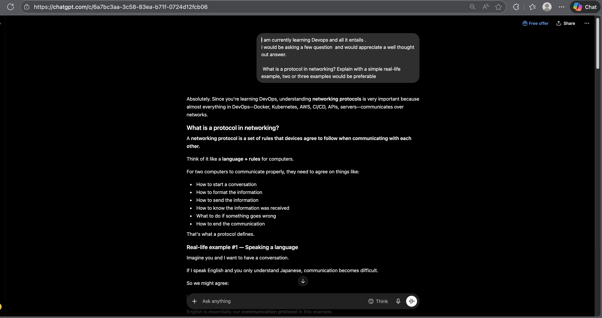
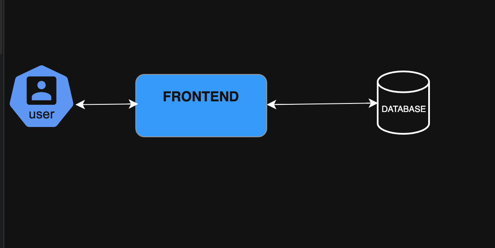
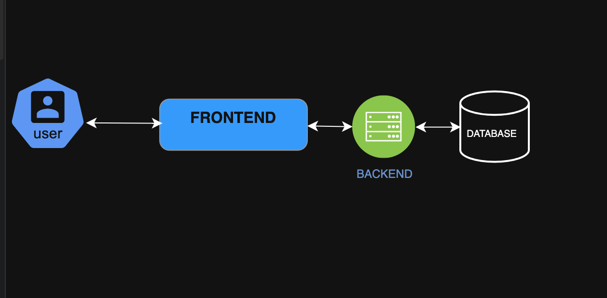
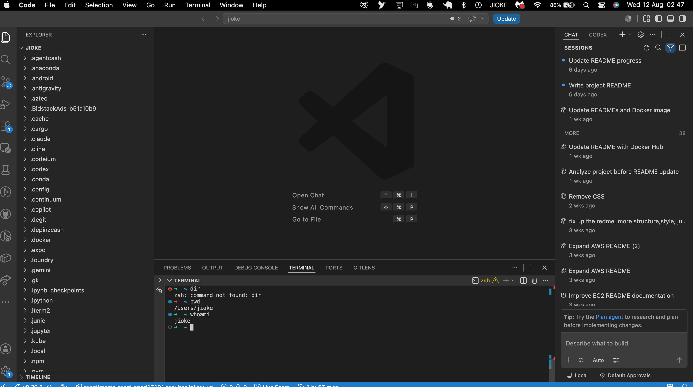

# Week 00 - Internet and Networking

Part of the DevOps Micro Internship (DMI) Cohort 3 with Agentic AI

---

# 🧑‍💻 Task 1: Using ChatGPT as Your Learning Assistant

## Scenario

You're new to DevOps and will frequently encounter technical questions. ChatGPT can be your learning companion.

## Your Task

Write a clear ChatGPT prompt to help you understand:

> "What is a protocol in networking? Explain with a simple real-life example."

Take a screenshot of your interaction showing:

* Your detailed prompt (with clear expectations)
* ChatGPT's simplified response with an example

## Screenshot

Save your screenshot in the `screenshots` folder and update the file name below.




Replace `task-1-chatgpt.png` with your actual screenshot file name.

---

## What I Learned (2–3 lines)

Add your answer here...
I learned that Network Protocols are the set of rules that guide how device communicate together , they incluse 
how to communicate, how to respond, format of the communication, how to know when a message is received, how to den communication
---

# 🌐 Task 2: Internet and Networking

## Scenario

Your friend is launching an online bookstore named **EpicReads**.

He asked you to explain how users globally can access his website hosted in Finland.

## Your Task

Write a short explanation (**100–150 words**) that includes:

* Packet Switching
* IP Address
* TCP/IP
* HTTP/HTTPS

💡 **Tip:** You may use ChatGPT (as demonstrated in Task 1) to refine your explanation.

## Answer

Add your answer here...

When a user in the USA wants to access EpicReads through the website name, DNS locates the IP address of the server in Finland, which is like the home address of the server.
The user's request is then broken down into packets. It is a method of breaking down the requested information into smaller chunks instead of sending it as one large piece. It allows the data to take different routes and arrive at the destination, where they are reassembled. This is known as packet switching.
TCP/IP determines how the user's device and the server communicate. The IP protocol is responsible for routing and addressing the data to the correct destination, while TCP ensures that the data is sent properly and arrives in the required order.
HTTP/HTTPS allows the browser and EpicReads to communicate. It handles web requests and responses, while HTTPS encrypts the data for secure communication between the user's browser and the server.


---

# 🏗️ Task 3: Application Architecture & Stack

## Scenario

EpicReads bookstore has two application versions:

### Two-Tier Application

* Frontend
* Database

### Three-Tier Application

* Frontend
* Backend
* Database

## Your Task

* Draw simple diagrams (hand-drawn or tool-based such as draw.io)
* Label each layer clearly
* List at least two common technologies or tools used for each layer
* Submit a screenshot or photo clearly showing your own drawing

## Diagram Screenshot / Photo

Save your diagram image in the `screenshots` folder and update the file name below.





Replace `task-3-diagram.png` with your actual diagram file name.

---

## Technologies Used

### Frontend

* Add your answer here... 
React
Angular
* Add your answer here...

### Backend

* Add your answer here...
Django
Flask
* Add your answer here...

### Database

* Add your answer here...
Sqlite
MySQL
* Add your answer here...

---

# 🌍 Task 4: Domain Name & DNS (Basic Concepts)

## Scenario

Your friend's bookstore **EpicReads** is currently accessible through:

```text
52.172.142.222:3000
```

He purchased the domain:

```text
epicreads.com
```

## Your Task

In **50–100 words**, explain in your own words:

1. What is DNS (Domain Name System)?
2. Which DNS record type should be used to connect the domain to the given IP, and why?

## Answer

Add your answer here...
Every device on the internet has an IP address, and IP addresses are not easy to memorize and remember. That is why domain names are used. It is a human-friendly, readable address for devices on the internet.
Domain Name System converts that domain name to an IP address that computers use to find and connect to the EpicReads.com server.
DNS record type A is used to connect because it maps a domain to an IPv4 address.
---

# 💻 Task 5: Visual Studio Code Setup (Hands-on)

## Your Task

Install Visual Studio Code (if not already installed).

Take a screenshot of your VS Code environment showing:

* Terminal open inside VS Code
* Running a basic command:

### Windows

```powershell
dir
```

### Linux / macOS

```bash
pwd
ls
```

* Your selected VS Code theme clearly visible

⚠️ **Important:** The screenshot must show your username or another identifiable detail to confirm it is your environment.

## Screenshot

Save your screenshot in the `screenshots` folder and update the file name below.




Replace `task-5-vscode.png` with your actual screenshot file name.

---

# 🔗 Task 6: Publish Your Assignment as a LinkedIn Post

## Objective

Publishing on LinkedIn helps you:

* Build your professional online presence
* Reinforce your learning
* Document your DevOps journey publicly

## Your Task

Summarize your answers from Tasks 1–5 into a LinkedIn post.

Clearly structure your post into the following sections:

* ChatGPT
* Internet & Networking
* App Architecture
* DNS
* VS Code Setup

Add the following credit note at the end of your post:

> **P.S. This post is part of the DevOps Micro Internship (DMI) with Agentic AI — Cohort 3 — by Pravin Mishra. My graded progress is public: https://dmi.pravinmishra.com/s/YOUR-GITHUB-USERNAME.html · Start your DevOps journey: https://dmi.pravinmishra.com/?utm_source=student&utm_medium=ps-linkedin&utm_campaign=cohort3**

---

## LinkedIn Post URL

Paste your LinkedIn post URL here:

```text
Add your URL here...

https://www.linkedin.com/posts/larryson-chijioke-aab710237_dmibypravinmishra-devops-devopsjourney-ugcPost-7493131093483741184-bWAm/?utm_source=share&utm_medium=member_desktop&rcm=ACoAADsEGyMBHFQ25QBObOJBLxT1NuceJxZJOIc
```

---

## LinkedIn Post Backup Copy

Paste the full text of your LinkedIn post here:

Add your post content here...

Week 00 of my DevOps journey
I’ve started the DMI Foundation Track, and this week I focused on some of the basics I need to understand as I continue learning DevOps.
Here’s what I worked on:

ChatGPT
I learned how to use ChatGPT to break down technical concepts and understand them with simple examples. I also learned how to use ChatGPT to debug like a pro and approach technical problems more effectively.

🌐 Internet & Networking
I learned about networking protocols and how a user can access a website hosted in another country. I covered IP addresses, packet switching, TCP/IP, and HTTP/HTTPS.

Application Architecture
I learned the difference between two-tier and three-tier architecture and how the frontend, backend, and database interact.

DNS
I learned how DNS connects a domain name to an IP address, why we use human-readable domain names instead of having to remember IP addresses, and why an A record is used for an IPv4 address.

VS Code
I set up my VS Code environment and used the integrated terminal to run some basic commands.
It’s just the beginning, but I’m getting a better understanding of the foundations behind how applications and systems communicate.
Looking forward to learning more and building on these foundations.

P.S. This post is part of the DevOps Micro Internship (DMI) — Foundation Track — by Pravin Mishra. My graded progress is public: https://lnkd.in/eAxnd7g8 · Start your DevOps journey: https://lnkd.in/etseUhde
#DMIByPravinMishra #DevOps #DevOpsJourney #Networking

---

# Reflection – Week 0

### What did you find easy?

Add your answer here...
I found understanding the way the internet works  easy, especially the protcols that guide the internet from ip, TCP and UDP , it really set a string foundation for me going forward
---

### What was difficult?

Add your answer here...
Record type still feels a little difficult to grasp the concept
---

### What will you improve next week?

Add your answer here...

---

## 📌 About DMI & CloudAdvisory

DevOps Micro Internship (DMI) is a project-based DevOps program run by Pravin Mishra (The CloudAdvisory) focused on real-world execution, systems thinking, and career readiness.

It helps learners build strong DevOps foundations with hands-on experience.


## 📌 Resources

- 🌐 **DMI Official Website:** https://dmi.pravinmishra.com?utm_source=github&utm_medium=readme  
- 🎓 **University:** https://university.pravinmishra.com?utm_source=github&utm_medium=readme  
- 💬 **Discord Community:** https://discord.pravinmishra.com?utm_source=github&utm_medium=readme  
- 📝 **Blog:** https://dmi.pravinmishra.com/blog?utm_source=github&utm_medium=readme  
- ▶️ **YouTube Playlist (DMI Cohort 3):** https://www.youtube.com/playlist?list=PLFeSNDtI4Cho  
- 🔗 **Pravin Mishra (LinkedIn):** https://www.linkedin.com/in/pravin-mishra-aws-trainer/  
- 🏢 **CloudAdvisory (LinkedIn):** https://www.linkedin.com/company/thecloudadvisory/

---

*This submission is part of DevOps Micro Internship (DMI) Cohort 3 — Agentic AI Track*