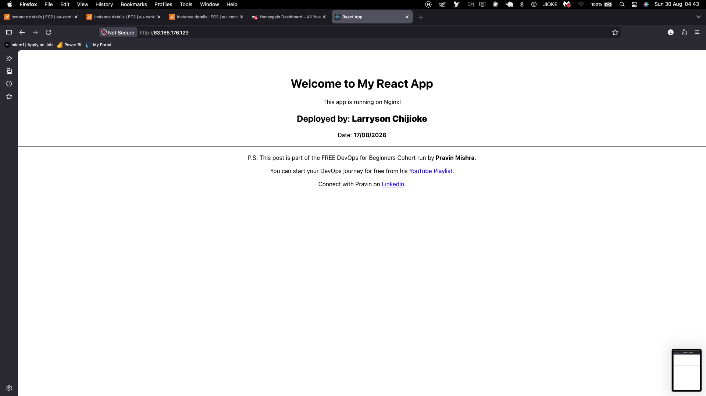
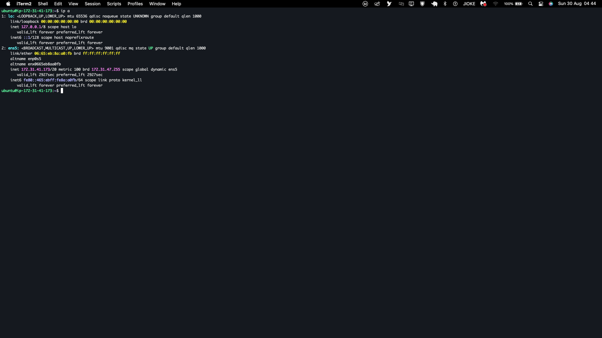
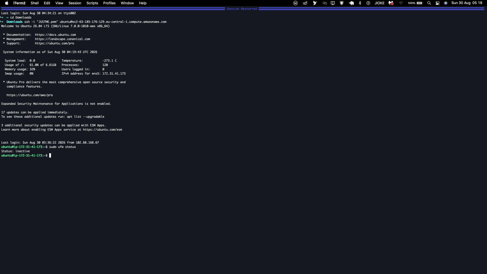
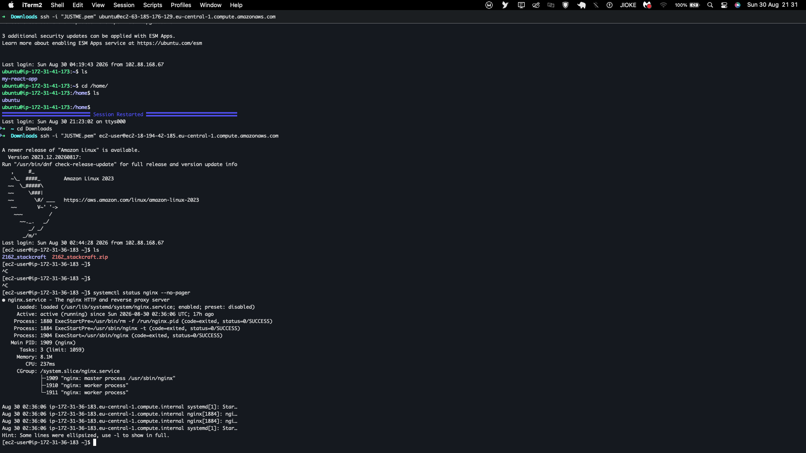
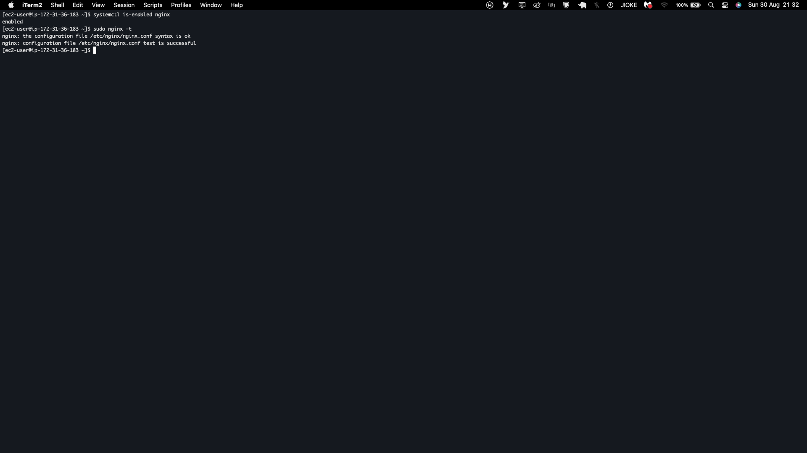

# Assignment 3 — Production Maintenance Drill (OPS Checklist)

Part of the DevOps Micro Internship (DMI) Cohort 3 with Agentic AI

---

## Purpose

In this assignment, you will treat your already deployed React application (on Ubuntu VM with Nginx) as a live production system. You will perform structured operational checks covering network validation, service health, log analysis, resource monitoring, configuration verification, and incident simulation with recovery — mirroring real on-call DevOps responsibilities.

---

# Task 1 — Server Access & Networking Validation

## Goal

Verify that the deployed React application is reachable from the browser and confirm basic network connectivity of the Ubuntu VM.

### Evidence

#### Screenshot 1 — Browser showing the React app with your Full Name visible on the UI

Add your screenshot here.

---

#### Screenshot 2 — Output of `ip a`

Add your screenshot here.

---

#### Screenshot 3 — Output of `sudo ss -tulpen`

Add your screenshot here.

---

#### Screenshot 4 — Output of `sudo ufw status`

Add your screenshot here.

---

### Notes

Answer the following in your own words:

**1. What proves Nginx is listening on 0.0.0.0:80?**

Write your answer here.

1. Nginx is listening at `0.0.0.0:80` because when I ran `sudo ss -tulpen`, the state showed 'LISTEN ', which means the port is active and waiting for connections.

---

**2. What proves SSH is active on port 22?**

Write your answer here.

SSH is an active port because its state is "LISTEN", meaning it is currently listening for requests on `0.0.0.0:22` when I ran `sudo ss -tulpen`.

---

**3. Did you find any unexpected open ports? Explain briefly.**

Write your answer here.

3. I found port 53 running on `127.0.0.53` and `127.0.0.54`, but these are local DNS resolver ports and are not publicly accessible. I also found `[::]:22`, which is SSH listening on IPv6. Therefore, I did not find any unexpected publicly open ports.

---

# Task 2 — Service Health & Systemd Validation (Nginx)

## Goal

Verify that Nginx is properly installed, running, enabled at boot, and safely configured.

### Evidence

#### Screenshot 1 — Output of `systemctl status nginx --no-pager`

Add your screenshot here.

---

#### Screenshot 2 — Output of `sudo nginx -t`

Add your screenshot here.

---

#### Screenshot 3 — Output of `sudo ss -lptn '( sport = :80 )'`

Add your screenshot here.

---

### Notes

Answer the following in your own words:

**1. What happens if Nginx fails to restart in production?**

Write your answer here.

Nginx could fail to start automatically after the server reboots if it is not enabled to start at boot. This could make the website unavailable until Nginx is started manually.
---

**2. What's your basic rollback plan?**

Write your answer here.

My basic rollback plan would be to restore the previous working configuration, test it, and restart Nginx
---

# Task 3 — Logs & Request Trace

## Goal

Verify real traffic flow and analyze logs to understand system behavior and errors.

### Evidence

#### Screenshot 1 — Output of `sudo tail -n 30 /var/log/nginx/access.log`

Add your screenshot here.

---

#### Screenshot 2 — Output of `sudo tail -n 30 /var/log/nginx/error.log`

Add your screenshot here.

#### Screenshot 3 — Output of `sudo journalctl -u nginx --no-pager -n 50`

Add your screenshot here.

---

### Notes

Answer the following in your own words:

**1. Were there any errors in the logs?**

- If yes, mention 1–2 example error lines from the logs and explain what each one means in simple terms.
- If no, explain what it means if the error log is empty or shows no recent errors during your check.

Write your answer here.

Yes. The Nginx error log contained several errors. However, the errors were mainly caused by external clients requesting files or URLs that do not exist on the server.

For example:

open() "/usr/share/nginx/html/.env" failed (2: No such file or directory)
---

**2. If there were no errors, what does that indicate about the system?**

Write your answer here.

I noticed only the first error from the previous log entries, while no new critical errors were recorded during my current check. This indicates that Nginx was running normally during the period I analyzed and did not record any new critical issues.

However, this does not mean that the system is permanently perfect. It only means that no new issues were recorded during the specific period I checked.
---
---

**3. Based on the access logs, were your curl requests visible in the log entries? What does that prove about traffic flow?**

Write your answer here.

Yes, my curl requests were visible in the Nginx access log.

I could see HTTP requests such as:

"GET / HTTP/1.1"

with a successful HTTP response status such as:

200

This proves that my curl request successfully reached the EC2 instance, was processed by Nginx, and was recorded in the access log.

Therefore, I verified the traffic flow from my client to the EC2 instance and through the Nginx web server.
---

# Task 4 — System Resource Health Check (Capacity Red Flags)

## Goal

Assess server capacity and detect potential performance or failure risks.

### Evidence

#### Screenshot 1 — Output of `uptime`

Add your screenshot here.

---

#### Screenshot 2 — Output of `free -h`

Add your screenshot here.

---

#### Screenshot 3 — Output of `df -h`

Add your screenshot here.

---

#### Screenshot 4 — Output of `sudo du -sh /var/* | sort -h`

Add your screenshot here.

---

### Notes

Answer the following in your own words:

**1. Which resource looks most critical right now? (CPU/load, memory, or disk) Explain why.**

Write your answer here.

After reviewing the operational outputs on this EC2 instance:

All system resources currently look healthy and well within safe operational limits. The CPU load average from uptime is below 0.10, showing the processor is idle. Memory from free -h shows adequate available RAM with zero swap usage. Disk usage from df -h sits at a comfortable average of 24%.

However, on an AWS micro-instance (typically 1 GB RAM), Memory (free -h) remains the most critical metric to watch continuously. Because physical RAM is limited, any sudden spike in traffic or memory-heavy process could trigger the Linux OOM (Out Of Memory) Killer, terminating active services like Nginx without warning.

**2. What happens if disk becomes 100% full in a production server?**

Write your answer here.

When disk storage hits 100% (No space left on device), the server experiences cascading operational failures:

Logging Halts: Nginx and system daemons cannot write to /var/log, which causes worker processes to stall, drop connections, or crash.

Process Failures: Applications cannot generate temporary lock files, session files, or PID files in /tmp and /run, causing services to fail on execution or restart.

SSH Admin Lockout: The OpenSSH daemon and PAM modules cannot write session entries (/var/log/lastlog or /var/run/utmp), locking engineers out of terminal access during an active outage.

Data Corruption: Any local databases or persistent state caches terminate write transactions abruptly, risking data inconsistency or table corruption.
---

# Task 5 — Configuration & Deployment Verification

## Goal

Ensure the correct React build is deployed and Nginx is serving it properly.

### Evidence

#### Screenshot 1 — Output of `ls -lah /var/www/html | head -n 20`

Add your screenshot here.

---

#### Screenshot 2 — Output of `grep -R "Deployed by" -n /var/www/html 2>/dev/null | head`

Add your screenshot here.

---

#### Screenshot 3 — Output of `grep -n "try_files" /etc/nginx/sites-available/default`

Add your screenshot here.

---

### Notes

Answer the following in your own words:

**1. How do you confirm that the correct version of the application is deployed?**

Write your answer here.
I verified the deployment by checking both the server internals and the live browser view:

Checked the web root (ls -lah /var/www/html): I verified that the compiled build files are actually sitting in /var/www/html. The directory contains the production assets (index.html, static/js/, static/css/) rather than development source code, with proper permissions and recent modification timestamps.

Verified the build identifier (grep check): To ensure Nginx isn't serving an outdated build or old cache, I searched the bundled files for my custom release tag:

grep -R "Deployed by" -n /var/www/html 2>/dev/null | head

This confirmed that "Deployed by Larryson Chijioke" is compiled directly inside the active JavaScript bundle.

Checked Nginx routing (grep try_files): I checked /etc/nginx/sites-available/default to ensure Nginx points its root to /var/www/html and includes try_files $uri $uri/ /index.html;. This guarantees that client-side React routes won't throw 404 errors when a user refreshes deep pages.
---

# Task 6 — Nginx Configuration Failure Simulation

## Goal

Simulate a real-world Nginx misconfiguration and recover the service safely.

### Evidence

#### Screenshot 1 — Output of `sudo nginx -t` showing the syntax error (broken config)

Add your screenshot here.

---

#### Screenshot 2 — Output of `sudo nginx -t` showing syntax ok (fixed config)

Add your screenshot here.

---

#### Screenshot 3 — Output of `curl -I http://<public-ip>` confirming recovery (200 OK)

Add your screenshot here.

---

### Notes

Answer the following in your own words:

**1. What caused the configuration failure?**

Write your answer here.
he failure was caused by a syntax error in /etc/nginx/sites-available/default. I removed the terminating semicolon (;) from the try_files directive. In Nginx syntax, every directive must end with a semicolon to mark its termination. Without it, the Nginx parser couldn't distinguish where the directive ended and threw an [emerg] syntax error during parsing.
---

**2. How did you fix the issue?**

Write your answer here.

I reopened /etc/nginx/sites-available/default using nano, re-added the missing semicolon at the end of the try_files $uri /index.html; directive, and saved the file. Before touching the running service, I verified the fix by running sudo nginx -t. Once it confirmed syntax is ok, I safely restarted the service using sudo systemctl restart nginx and verified the recovery with curl -I.
---

**3. How can you avoid this kind of issue in real production systems?**

Write your answer here.
To prevent bad configuration from taking down production, I would follow three industry best practices:

Never restart without testing: Always run sudo nginx -t before issuing any systemctl reload or restart. If the test fails, do not touch the running daemon.

Prefer reload over restart: Use sudo systemctl reload nginx instead of restart. A reload applies new configurations without dropping active client connections, and Nginx will keep the old configuration running if the new one is invalid.

Automated CI/CD linting & version control: Keep all server blocks and Nginx configuration files in Git. Run automated configuration linters (nginx -t inside a containerized CI runner) to catch typos and syntax mistakes before code ever merges to main or touches a live server.
---

# Task 7 — Web Application Failure Simulation

## Goal

Simulate missing deployment content and recover the application safely.

### Evidence

#### Screenshot 1 — Output of `curl -I http://<public-ip>` showing failure (non-200 response)

Add your screenshot here.

---

#### Screenshot 2 — Output of `curl -I http://<public-ip>` confirming recovery (200 OK)

Add your screenshot here.

---

### Notes

Answer the following in your own words:

**1. What caused the application to break in this scenario?**

Write your answer here

The failure was caused by missing deployment content in the document root directory (/var/www/html). When the live files were moved to a backup directory and replaced with an empty folder, Nginx could no longer find index.html or any compiled assets. Because directory indexing is disabled by default for security, Nginx threw an HTTP 403 Forbidden (or 404 Not Found) error instead of serving the application.
---

**2. How did you fix the issue and restore the application?**

Write your answer here.
I resolved the incident by performing a quick rollback to our known good state. I removed the empty /var/www/html placeholder directory and moved our backup directory back into place using sudo mv /var/www/html_backup /var/www/html. Once the files were restored, I restarted Nginx with sudo systemctl restart nginx and verified that requests returned an HTTP 200 OK via curl -I-

**3. What steps would you take to prevent this kind of issue in real production systems?**

Write your answer here.

To prevent missing-file outages and broken deployments in production, I would implement:

Atomic Deployments via Symlinks: Instead of overwriting files in-place, deploy new builds into timestamped release folders (e.g., /var/www/releases/v1.2.0) and point /var/www/html to it using a symbolic link (ln -sfn). A switch or rollback is instant and atomic, meaning zero downtime or empty directory windows.

Automated Pre-flight & Post-deployment Smoke Tests: In the CI/CD pipeline, run automated curl checks right after a release. If the endpoint doesn't return a 200 OK with expected DOM elements, trigger an automatic rollback to the previous release.

Immutable Artifacts & Containerization: Package the React build directly into a Docker container image alongside Nginx. This eliminates filesystem discrepancies across servers because the build artifacts are baked directly into the image.
---

# Task 8 — Security & Reliability Review

## Goal

Review and reflect on the security and reliability practices applied during this assignment.

### Security & Reliability Notes

Answer the following in your own words:

**1. Why is SSH key-based authentication more secure than sharing passwords?**

Write your answer here.
Passwords rely on shared secrets that are vulnerable to brute-force attacks, dictionary scans, credential stuffing, and interception. In contrast, SSH key authentication uses asymmetric cryptography (a public key placed on the server and a private key kept securely on the client machine).

The private key never travels over the network during authentication; instead, the server verifies identity through mathematical challenge-response signatures. With modern algorithms (like Ed25519 or RSA 4096-bit), brute-forcing a key is computationally infeasible. Additionally, key access can be individually rotated, revoked, or tied to a hardware token without requiring password changes across an entire team.
---

**2. Why should only required ports be open on a production server?**

Write your answer here.

Every open network port represents an active listening service and an entry point into your operating system—expanding your server's attack surface. If an unnecessary port is open (such as an unprotected database port, a debug daemon, or a legacy protocol), any unpatched vulnerability or misconfiguration in that service can allow attackers to gain remote access, inject malware, or execute arbitrary code.

Following the principle of least privilege, a web server should only expose port 80 (HTTP) and port 443 (HTTPS) to the public internet, with port 22 (SSH) strictly firewalled and restricted to specific bastion hosts or administrative IP ranges.
---

**3. Why is it important for Nginx to be enabled on boot?**

Write your answer here.

In cloud environments, virtual machines reboot for reasons outside an engineer's manual control—such as underlying hypervisor maintenance, automated kernel security patch reboots, hardware migration, or unexpected kernel panics.

If Nginx is running but not enabled (systemctl enable nginx), the systemd service symlink in /etc/systemd/system/multi-user.target.wants/ will not exist. When the VM comes back online, the OS will boot, but the web server will remain completely dead until an engineer manually logs in to start it. Enabling Nginx on boot ensures automatic self-healing and zero manual intervention during unplanned restarts, maintaining application availability.
---

**4. What are the risks of sharing secrets, keys, or credentials publicly?**

Write your answer here.
Publicly exposing secrets—such as AWS access keys, SSH private keys, database credentials, or API tokens (for instance, by accidentally pushing an .env file to a public GitHub repository)—leads to catastrophic security breaches.

Automated web scrapers and botnets continuously index public repositories within seconds of a commit. Attackers can hijack your cloud account to spin up unauthorized high-compute resources (such as cryptocurrency mining rigs), exfiltrate proprietary customer data, delete production databases, or hold the infrastructure hostage. Once a key is exposed publicly, it must be considered instantly compromised and revoked immediately.
---

**5. Why should cloud resources be stopped or terminated when they are no longer needed?**

Write your answer here.
Unused cloud infrastructure introduces two significant risks:

Financial Waste (Cloud Sprawl): Cloud providers bill continuously for provisioned resources—running EC2 compute hours, attached EBS storage volumes, and allocated Elastic IPs all incur ongoing charges whether they serve traffic or sit completely idle.

Security Blind Spots (Zombie Resources): Forgotten, unmonitored virtual machines are rarely updated or patched. Over time, they accumulate known Common Vulnerabilities and Exposures (CVEs), turning into easy targets for attackers seeking pivot points into your broader virtual private cloud (VPC).
---

# LinkedIn Post (Required)

## Evidence

#### LinkedIn Post URL

Paste your LinkedIn post URL here:

`Add your URL here`

---
https://lnkd.in/p/ehUZNNaa

#### Screenshot — Published LinkedIn post

Add your screenshot here.

---

# Submission Instructions

- Add all required screenshots in your submission
- Full name must be visible in required screenshots
- Do not expose sensitive information (keys, passwords, account IDs)

---

# Completion Checklist

- [ ] Task 1: Screenshots (browser, ip a, ss -tulpen, ufw status) + Notes answered
- [ ] Task 2: Screenshots (nginx status, nginx -t, ss port 80) + Notes answered
- [ ] Task 3: Screenshots (access log, error log, journalctl) + Notes answered
- [ ] Task 4: Screenshots (uptime, free -h, df -h, du -sh) + Notes answered
- [ ] Task 5: Screenshots (ls html, grep deployed by, grep try_files) + Notes answered
- [ ] Task 6: Screenshots (nginx -t fail, nginx -t pass, curl recovery) + Notes answered
- [ ] Task 7: Screenshots (curl failure, curl recovery) + Notes answered
- [ ] Task 8: Security & Reliability Notes answered
- [ ] LinkedIn post published and URL submitted
- [ ] Full Name visible in all required screenshots
- [ ] No sensitive data exposed

---

## 📌 About DMI & CloudAdvisory

DevOps Micro Internship (DMI) is a project-based DevOps program run by Pravin Mishra (The CloudAdvisory) focused on real-world execution, systems thinking, and career readiness.

It helps learners build strong DevOps foundations with hands-on experience.

---

## 📌 Resources

- 🌐 DMI Official Website: https://dmi.pravinmishra.com?utm_source=github&utm_medium=readme  
- 🎓 University: https://university.pravinmishra.com?utm_source=github&utm_medium=readme  
- 💬 Discord Community: https://discord.pravinmishra.com?utm_source=github&utm_medium=readme  
- 📝 Blog: https://dmi.pravinmishra.com/blog?utm_source=github&utm_medium=readme  
- ▶️ YouTube Playlist: https://www.youtube.com/playlist?list=PLFeSNDtI4Cho  
- 🔗 Pravin Mishra (LinkedIn): https://www.linkedin.com/in/pravin-mishra-aws-trainer/  
- 🏢 CloudAdvisory (LinkedIn): https://www.linkedin.com/company/thecloudadvisory/

---

*This submission is part of DevOps Micro Internship (DMI) Cohort 3 — Agentic AI Track.*